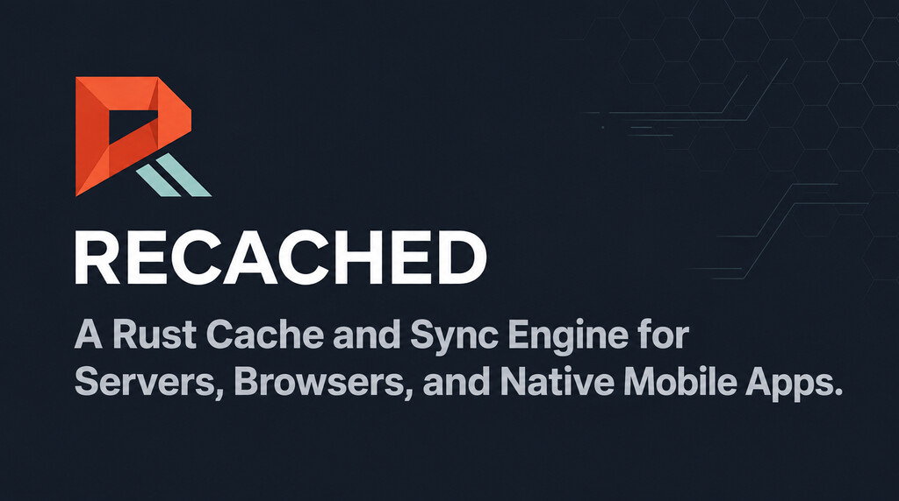
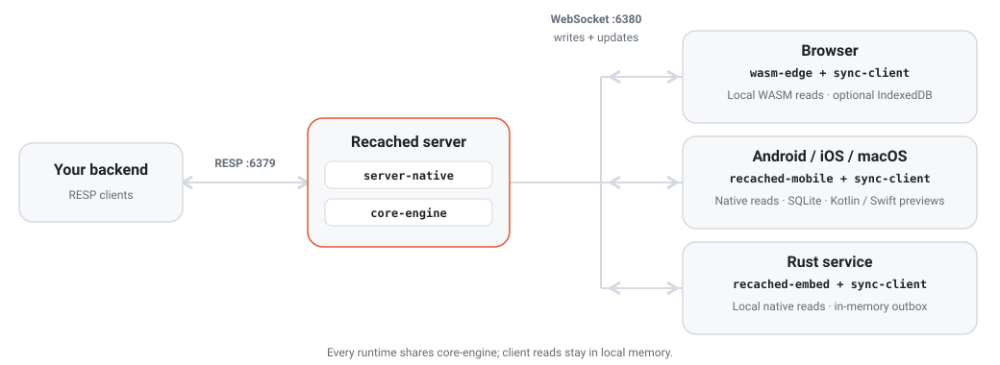

<div align="center">
  
  <h1>Recached</h1>
  <p><b>A Rust cache and sync engine for servers, browsers, and native mobile apps.</b></p>
  <p>Local client reads. Shared state over WebSocket. One Rust engine.</p>

  <a href="https://recached.dev"></a>
  <a href="https://www.npmjs.com/package/recached-edge"></a>
  <a href="https://www.rust-lang.org"></a>
  <a href="https://webassembly.org"></a>
  <a href="LICENSE.md"></a>
</div>

---

Recached keeps a local copy of shared cache data where your application reads it: in a browser tab, a native Android or Apple app, or an embedded Rust service. Clients read local memory and exchange writes and server updates over WebSocket. Your backend uses the server's RESP command subset on port 6379.

The same `core-engine` runs on every target. Browser clients use WebAssembly and optional IndexedDB persistence. Native Kotlin and Swift clients use `recached-mobile` through UniFFI, with SQLite persistence for local data and queued writes. The native SDKs are implemented previews; their package configs do not yet pin a released mobile core.

The server executes commands across worker threads over a sharded keyspace. Scaling depends on your keys being spread across shards; see [benchmarks](#benchmarks) and the [concurrency model](https://recached.dev/server/commands#concurrency-model).

| Application | Client | Local persistence | Getting started |
|---|---|---|---|
| Browser | `recached-edge` (WebAssembly), React and Vue adapters | Optional IndexedDB WAL and outbox | [Browser](https://recached.dev/browser/getting-started) |
| Android | Kotlin `recached-android`, `Flow` observers | SQLite data and outbox | [Android preview](https://recached.dev/android/getting-started) |
| iOS / macOS | Swift `Recached`, `AsyncStream` and SwiftUI models | SQLite data and outbox | [Apple preview](https://recached.dev/ios/getting-started) |
| Rust service | `recached-embed` | In-memory store and outbox | [Rust](https://recached.dev/rust/getting-started) |

See [client support and limits](https://recached.dev/guide/client-support) for differences between adapters. React Native and Flutter are planned.

> [!NOTE]
> Recached implements a Redis command subset: strings, expiry, counters, hashes, lists, sets, sorted sets, transactions, pub/sub, and observable keys, plus JSON and rate limiting. Client SDKs expose smaller APIs than the server. Best fit: shared UI state, offline-capable apps, config caches, and rate limiting.
>
> Notably absent: **Lua scripting (`EVAL`)**, **blocking operations** (`BLPOP`, `BRPOP`, `LMOVE`) and **streams** (`XADD`). Your Redis *client* will connect unchanged, but libraries built on those primitives — BullMQ, node-redlock, rate-limiter-flexible — ship Lua and will not run. `RLCHECK`/`RLSET` cover rate limiting natively instead. Run `COMMAND COUNT` against a live server for the exact surface (124 entries in this checkout).

**→ Full documentation, use cases, API reference, and guides at [recached.dev](https://recached.dev)**

---

## Install

```bash
# Docker
docker run -p 6379:6379 -p 6380:6380 ghcr.io/recached-sh/recached:latest

# Homebrew (macOS) — the tap is this repo, and Homebrew 6+ wants third-party taps trusted
brew tap recached-sh/recached https://github.com/recached-sh/recached.git
brew trust recached-sh/recached   # Homebrew 6.0+ only; older versions do not have it
brew install recached && recached-server

# Cargo (from source — the crate is not on crates.io yet)
cargo install --git https://github.com/recached-sh/recached.git recached && recached-server
```

```bash
# Browser / Edge (npm)
npm install recached-edge
```

```bash
# Rust service (embedded client — reads come from local process memory)
cargo add --git https://github.com/recached-sh/recached.git recached-embed
```

For native apps, follow the [Kotlin source-build instructions](https://recached.dev/android/getting-started#build-the-preview) or [Swift source-build instructions](https://recached.dev/ios/getting-started#build-the-preview). Android needs API 24+; Swift supports iOS 15+ and macOS 12+. A versioned Maven or SwiftPM dependency is not yet the install path for this preview.

> [!IMPORTANT]
> **Install `recached-edge@^0.3.4`.** Every published version from 0.1.3 to 0.3.0 shipped without
> wasm-pack's `snippets/` directory and failed to import at all; 0.3.1 is the first release that
> installs from npm. See the [changelog](CHANGELOG.md) for details.

---

## How it works

<p align="center">
  <picture>
    <source media="(prefers-color-scheme: dark)" srcset="assets/architecture-dark.svg">
    
  </picture>
</p>

Server changes reach connected clients according to their sync scopes and subscriptions. Client writes apply locally and queue for the server; accepted changes fan out to other clients. Browser and native app reads use local memory. Use `liveQuery(pattern)` in the browser or `watch(pattern)` on mobile to hydrate server data and reconcile missed changes after reconnecting.

A **Rust service** can be one of those connected clients too, via [`recached-embed`](https://recached.dev/rust/getting-started) — same engine, same sync protocol, holding its slice of the cache in its own heap instead of a tab's. Useful for config-shaped data read on every request: fare tables, feature flags, tenant settings, entitlement checks.

---

## Quick look

**Backend** — a RESP client using the supported command subset, port 6379:

```javascript
import Redis from 'ioredis';
const cache = new Redis('redis://127.0.0.1:6379');
await cache.set('inventory:item:99', '42');
```

**Browser** — WebAssembly, port 6380:

```typescript
import { createCache } from 'recached-edge';

const cache = await createCache({
  persistence: true,                        // survives page refresh via IndexedDB
  connect: { url: 'ws://127.0.0.1:6380' }, // syncs with the server
});

cache.liveQuery('inventory:*'); // initial snapshot, then live updates
cache.get('inventory:item:99'); // may miss before hydration; reads stay local
```

**Android (Kotlin preview)** uses the native Rust core and persists to SQLite:

```kotlin
import dev.recached.Recached
import dev.recached.RecachedConfig
import dev.recached.open

val cache = Recached.open(context, RecachedConfig(url = "ws://127.0.0.1:6380"))
cache.watch("inventory:*")
cache.observeString("inventory:item:99").collect { stock -> render(stock) }
```

**iOS / macOS (Swift preview)** uses the same native core:

```swift
import Foundation
import Recached

let cache = try Recached.open(
    named: "app",
    config: RecachedConfig(url: URL(string: "ws://127.0.0.1:6380")!)
)
cache.watch("inventory:*")
for await stock in cache.observeString("inventory:item:99") {
    render(stock)
}
```

These snippets assume an app context and a `render` function; collect Kotlin flows in a coroutine and iterate Swift streams in an async context. Use the Android emulator's host address or `adb reverse` to reach a development server. Mobile restores saved data before connecting; watch patterns must be registered again on each open. Observers emit the current local value and subsequent changes, coalescing updates for slow consumers.

These examples use plaintext development endpoints. Set `RECACHED_TLS_CERT` and `RECACHED_TLS_KEY`
and the same ports serve TLS — connect with `rediss://` and `wss://` instead. Before exposing either
port beyond localhost, work through
[recached.dev/server/security](https://recached.dev/server/security): a default server has no
password, no TLS, and no restriction on which web pages may open the sync socket.

`6379` and `6380` are defaults, not fixtures — set `RECACHED_PORT` and `RECACHED_WS_PORT` (plus
`RECACHED_METRICS_PORT`) to move them, which is also what running two instances on one host takes.

**The browser half also runs alone.** Drop `connect` and `recached-edge` never opens a socket — the
same engine runs in WASM as a standalone client cache with TTLs, counters, JSON documents, glob
queries, IndexedDB persistence and cross-tab sync, with no Recached server and no backend changes:

```typescript
const cache = await createCache({ persistence: true, broadcastChannel: 'my-app' });
cache.setJSON('user:42', user, 60); // expires on its own, survives a refresh
```

What you give up is what needs a peer: pub/sub, live queries and cross-device sync. See
[use cases: no server at all](https://recached.dev/guide/use-cases#no-server-at-all).

---

## Benchmarks

Recached's measured performance claim is narrow: command execution scales across worker threads. The project publishes no cross-project performance comparison, and these numbers are not one — they say nothing about how any other cache performs on this or any host.

The scaling run below changed only `RECACHED_WORKER_THREADS`. One binary, one workload, one fixed four-core CPU set — Intel i5-9400F, `powersave` governor, `PIN=1 SERVER_CPUS=0-3 BENCH_CPUS=4-5`, no persistence. Measured 2026-09-13 with `redis-benchmark` 8.10.1 (`-n 1000000 -c 50 -d 64 -r 100000 -P 16`):

| Worker threads | 1 | 2 | 4 |
|---|---:|---:|---:|
| `GET` | 819,672 | 1,689,189 | 1,658,375 |
| `SET` | 316,857 | 580,720 | 769,823 |
| `INCR` | 330,688 | 602,047 | 761,615 |
| **Total, keys spread over 100k** | **1,467,217** | **2,871,956** | **3,189,812** |
| Change from one thread | baseline | +96% | **+117%** |

**Scaling requires your writes to be spread across keys.** `redis-benchmark`'s collection tests (`LPUSH`, `SADD`, `HSET`, `ZADD`) push every operation into a single key, and that workload does not scale — it *regresses* about 27%, from 1,550,566 req/s on one thread to 1,134,772 on four, because one key lives on one shard and extra workers only add contention. Which half describes your deployment depends on whether you have hot keys. See [the benchmark guide](https://recached.dev/guide/benchmarks) for both tables.

One thread is the baseline the ratio is measured against, not a recommended deployment. This is evidence for parallel command execution on this build and host, nothing wider. Run [`scripts/bench-scaling.sh`](scripts/bench-scaling.sh) against the commit you plan to deploy.

On the same host, a server-side write reaches a subscribed browser over WebSocket in **151 µs at p50** (p99 698 µs) — measured with the project's own harness, since no RESP benchmark can see that path. Browser *reads* are a local WebAssembly memory lookup and never leave the tab.

Browser, mobile, and embedded Rust clients all read locally. The measurements above cover the server and browser sync path; they are not native mobile latency measurements.

## Maturity

Being honest about where things stand:

- **The cache server is a release candidate for cache workloads.** It includes persistence, ordered primary/replica replication, TLS, hardened parsers, metrics, and load/chaos tests. It has not completed broad production validation or an independent security audit. Treat it as a cache, not a system of record.
- **The shared sync layer (browser, mobile, and Rust clients) is beta.** Its invariants are [specified](https://recached.dev/server/protocol) and tested end-to-end. Read [Sync Scopes](https://recached.dev/server/sync-scopes) before exposing multi-tenant data.
- **The Kotlin and Swift SDKs are unreleased 0.1.0 previews.** They implement local reads, SQLite persistence, queued writes, reconnect recovery, and reactive observers. Build from source until their package configs pin released core artifacts. Deduplicated replay is bounded by server checkpoint and dedup retention; see [client limits](https://recached.dev/guide/client-support#write-durability-and-replay).

- **The embedded Rust client (`recached-embed`) is brand new and unpublished** — it works end-to-end against a live server and is covered by a live test suite, but it has no production miles and is not on crates.io.

The road to 1.0 is hardening, not features. Bug reports from production-like use are the most valuable contribution right now.

---

## Contributing

Bug reports, PRs, and feedback are all welcome.

1. Fork the repo and create a branch: `git checkout -b feat/my-feature`
2. Make your changes: server logic lives in `server-native/`, browser bindings in `wasm-edge/`, shared sync in `sync-client/`, and the native client core in `recached-mobile/`. Platform wrappers live in [recached-kotlin](https://github.com/recached-sh/recached-kotlin) and [recached-swift](https://github.com/recached-sh/recached-swift).
3. Run `cargo test --workspace` before opening a PR
4. Open a pull request with a clear description

Open an issue before large features or architectural changes. Areas where contributions are especially welcome:

- **Benchmarks** — run [`scripts/benchmark.sh`](scripts/benchmark.sh) on multi-core server hardware and share the results
- **Client examples** — browser, Kotlin/Compose, and Swift/SwiftUI demos
- **Bug reports** — edge cases in the RESP parser, TTL eviction, pub/sub delivery, or WebSocket sync

See [recached.dev/roadmap](https://recached.dev/roadmap) for what's planned.

Reach out: [dennis@thinkgrid.dev](mailto:dennis@thinkgrid.dev)

## License

Apache License 2.0 — © 2026 ThinkGrid Labs
